# VDI-6020-Validierungsbericht — Stand 2026-08-03

**Laufdatum:** 2026-07-29 · **Prüfaufbau:** abgeleitet aus VDI 6007-1 Anhang A (`vdi6020_ableitung.py`, `vdi6020_lauf.py`, `vdi6020_vergleich.py`)

**Ergebnisdateien:** `vdi6020_ergebnisse_2026_07_29_hauptlauf_kappa_voll.json` ist der HAUPTLAUF (κ_m = volle Schichtsumme, bewertete Bilanz); `vdi6020_ergebnisse_2026_07_29_sensitivitaet_kappa_13786.json` ist die SENSITIVITÄT (identischer Lauf, einzige geänderte Annahme: ISO-13786-Kappung der wirksamen Speicherkapazität).

**Ergebnis:** 0/7 Testbeispiele bestanden nach Maßstab „Typ a". Typ a ist die Toleranzklasse a der zulässigen Abweichungen nach VDI 6020:2022-12, Tabelle 2: je Auswertetag (Tag 1, 10, 60) müssen Mittelwert und Standardabweichung der stündlichen Abweichungsreihe Simulation − Referenz innerhalb fester Grenzen liegen — |MW| ≤ 1,0 K (Temperaturen) bzw. ≤ 50 W (Heiz-/Kühllast), SD ≤ 1,5 K bzw. ≤ 60 W. (Einordnung und Ursachen Abschn. 3; Reproduktion Abschn. 4.)

Terminologie nach Projektregel: VDI-Vergleich = **Validierung** (ISO-Vergleich = Verifizierung).

## 1 Prüfaufbau

Testbeispiele 1–7 nach VDI 6020:2022-12 Kap. 8 (Typräume S/L, 60 Tage, Anfangsbedingung 22 °C stationär, Auswertetage 1/10/60). Sämtliche Eingaben und Referenzwerte aus VDI 6007 Blatt 1:2015-06 Anhang A (Tabellen A.1–A.7, PDF-Textlayer, maschinell extrahiert mit Struktur-Assertions) sowie VDI 6020:2022-12 Tabelle 3 (α-Werte: α_S = 5, α_a = 20, α_i,vert = 2,7, α_i,hor = 1,7), Kap. 8 und Anhang C1 (Aufbauten; c·ρ-Kreuzprüfung gegen die A-Tabellen bestanden). Prüfreferenz: Spalten 'Ergebnisse VDI 6020' (n-K-Modell, Prüfreferenz nach VDI 6020 Tabelle 4); θ_op gegen Programm 1, da die n-K-Spalten keine operative Temperatur führen.

Maßstab: Toleranzklasse Typ a (VDI 6020:2022-12, Tabelle 2), je Auswertetag: |MW| ≤ 1,0 K bzw. 50 W; SD ≤ 1,5 K bzw. 60 W (Definition siehe Kopf). Ein Testbeispiel gilt als bestanden, wenn alle drei Auswertetage alle sechs Grenzen einhalten.

Modellierungsentscheidungen des ISO-52016-1-Prüfaufbaus (dokumentiert, nicht ergebnisangepasst): R_c = Σ d/λ; κ_m = volle Schichtsumme Σ ρ·c·d als HAUPTLAUF — gedeckt durch die Normprüffalltabellen 23/24 der ISO 52016-1 (z. B. Holzboden 19 500 J/(m²·K) = 0,025·650·1200); die ISO-13786-Kappung (wirksame Dicke) läuft als Sensitivität (`--kappa iso13786`). Kapazitätsverteilungsklasse je Bauteil aus einer festen Schwerpunktregel (siehe `vdi6020_ableitung.py`); Regelgröße θ_air; Anteil_Q_H/K_kon = 100 % → f_HC = 1,0; Fall-5-Fenstergewinne 'im Raum' als zweites internes Quellprofil mit a_kon = 0,09 (ISO-Verteiler beaufschlagt dabei — anders als VDI — auch das Fenster selbst anteilig; Flächenanteil ≈ 8 %).

## 2 Ergebnisse

| Fall | Tag | Δθ_air MW / SD [K] | Δθ_op MW / SD [K] | ΔQ MW / SD [W] | Typ a erfüllt? |
|---|---|---|---|---|---|
| 1 | 1 | -0.35 / 0.35 | -0.18 / 0.37 | +0.0 / 0.0 | bestanden |
| 1 | 10 | -5.96 / 0.20 | -6.04 / 0.23 | +0.0 / 0.0 | **verletzt** |
| 1 | 60 | -1.76 / 0.19 | -1.50 / 0.23 | +0.0 / 0.0 | **verletzt** |
| 2 | 1 | -0.31 / 0.33 | -0.20 / 0.40 | +0.0 / 0.0 | bestanden |
| 2 | 10 | -5.74 / 0.15 | -6.10 / 0.24 | +0.0 / 0.0 | **verletzt** |
| 2 | 60 | -1.33 / 0.12 | -1.51 / 0.22 | +0.0 / 0.0 | **verletzt** |
| 3 | 1 | -1.33 / 1.02 | -1.51 / 1.03 | +0.0 / 0.0 | **verletzt** |
| 3 | 10 | -7.13 / 0.44 | -7.59 / 0.95 | +0.0 / 0.0 | **verletzt** |
| 3 | 60 | +0.07 / 0.46 | +0.21 / 0.94 | +0.0 / 0.0 | bestanden |
| 4 | 1 | -1.43 / 0.97 | -1.53 / 1.03 | +0.0 / 0.0 | **verletzt** |
| 4 | 10 | -7.00 / 0.48 | -7.67 / 0.91 | +0.0 / 0.0 | **verletzt** |
| 4 | 60 | +0.34 / 0.49 | +0.21 / 0.90 | +0.0 / 0.0 | bestanden |
| 5 | 1 | -0.26 / 0.28 | -0.10 / 0.37 | +0.0 / 0.0 | bestanden |
| 5 | 10 | -4.82 / 0.14 | -5.04 / 0.31 | +0.0 / 0.0 | **verletzt** |
| 5 | 60 | -1.48 / 0.11 | -1.52 / 0.32 | +0.0 / 0.0 | **verletzt** |
| 6 | 1 | +0.00 / 0.00 | -0.15 / 0.26 | +66.8 / 68.0 | **verletzt** |
| 6 | 10 | +0.00 / 0.00 | -0.03 / 0.17 | +11.4 / 38.9 | bestanden |
| 6 | 60 | +0.00 / 0.00 | +0.02 / 0.17 | -7.4 / 39.3 | bestanden |
| 7 | 1 | -0.07 / 0.13 | -0.15 / 0.35 | +55.9 / 63.6 | **verletzt** |
| 7 | 10 | -0.29 / 0.30 | -0.55 / 0.39 | +33.1 / 37.8 | bestanden |
| 7 | 60 | -0.05 / 0.08 | -0.17 / 0.24 | -8.2 / 18.0 | bestanden |

**Bilanz: 0/7 Testbeispiele bestanden.**

Diagramme je Fall und Auswertetag: Abschnitt 5 (drei Linien: Norm-Referenz schwarz, Hauptlauf rot durchgezogen, Sensitivität rot gestrichelt).

## 3 Befunde und Charakterisierung der Abweichungen

**Zweck der Sensitivitätsrechnung:** identischer Lauf mit genau EINER geänderten Annahme — der wirksamen Speicherkapazität (volle Schichtsumme Σρ·c·d vs. ISO-13786-Kappung; die Norm ist hier selbst uneindeutig, Prüffalltabellen 23/24 gegen die B.14-Pauschalen). Ergebnis am Tag-10-Einschwingen (MW Δθ_air, Fälle 1–5): Hauptlauf -7.1…-4.8 K UNTER der n-K-Referenz, Sensitivität +2.2…+4.3 K darüber — die Referenz liegt innerhalb der Spanne. Die Abweichung ist damit der Kapazitätsannahme des 5-Knoten-Verfahrens zuzuordnen, nicht der Implementierung: ein Implementierungsfehler könnte die Referenz nicht systematisch einklammern.

**V1 — Mehrtages-Einschwingen (Fälle 1–5):** Mit κ_voll (Hauptlauf, gesamte Speichermasse) liegt Tag 10 um −4,8…−7,1 K (θ_air) bzw. bis −7,7 K (θ_op) UNTER der n-K-Referenz — die volle Schichtsumme macht die Räume für das Mehrtages-Einschwingen zu träge; folgerichtig sind auch die Tag-60-Mittel der Fälle 1/2/5 mit −1,3…−1,8 K noch nicht eingeschwungen (Zeitkonstanten im Wochenbereich), während die leichten Fälle 3/4 Tag 60 jetzt bestehen. Die 13786-Sensitivität (wirksame Dicke, 24-h-Kapazität) kehrt das Vorzeichen um: Tag 10 dann +2,2…+4,3 K, Tag 60 der Fälle 1/2/5 im Maßstab. Die beiden Ansätze KLAMMERN die Referenz ein — die Abweichung ist vollständig durch den Kapazitätsansatz des 5-Knoten-Verfahrens erklärt: Das Mehrtages-Einschwingen erfordert eine frequenzabhängig wirksame Masse zwischen 24-h-Wert und Gesamtkapazität, die das ISO-52016-1-Knotenmodell konstruktionsbedingt nicht abbildet (Verfahrensgrenze, kein Implementierungs-fehler). Quellenlage beider Ansätze: Die Normprüffall-tabellen 23/24 leiten κ_m als volle Schichtsumme her (Eingabe-Konvention des Hauptlaufs); die informativen B.14-Pauschalen (z. B. 'sehr schwer' 250 kJ/(m²·K)) entsprechen dagegen der 24-h-wirksamen Größenordnung — die Norm selbst ist hier nicht eindeutig.

**V2 — Tagesdynamik Typraum L (Fälle 3/4, Tag 1):** MW −1,3…−1,4 K bei SD ≈ 1,0 K — mit κ_voll zu träge (Vorzeichen gegenüber der 13786-Sensitivität gedreht, dort ca. +1,2 K zu warm). Der L-Raum hat innenseitig sehr wenig wirksame Masse (FB: 3 cm Estrich; DE: 1 mm Metall vor Dämmung); die Knotenverteilung reagiert auf die Lastsprünge anders als das voll aufgelöste Referenzmodell. Gleiche Ursachenfamilie wie V1.

**V3 — Lastfälle 6/7 (Tag 1 knapp gerissen, Tag 10/60 bestanden):** Fall 6 Tag 1: MW +66,8 W (Grenze 50), SD 68,0 W (Grenze 60) — praktisch massenunempfindlich (13786-Sensitivität nahezu identisch). Zwei belegbare Anteile: (a) Der ISO-52016-Strahlungsverteiler beaufschlagt die Fensterinnenfläche flächenproportional mit der strahlenden 1000-W-Quelle (A_F/A_tot = 7/86 ≈ 8,1 % ≈ 81 W), die dort teilweise direkt nach außen abfließt — die VDI-Konvention schließt die Verglasung aus der Verteilung aus (VDI 6020 S. 50/51); die beobachtete Nachtlast-Differenz entspricht dieser Größenordnung (dokumentierter Konventionsunterschied; die ISO-Lesart ist physikalisch begründet und wurde bewusst nicht zur VDI-Anpassung umgebaut). (b) Die Lastspitze der Sprungstunde fällt im Knotenmodell anders aus als im n-K-Modell. Fall 7 Tag 1: MW +55,9 W / SD 63,6 W knapp über den Grenzen — mit κ_voll sättigt die ±500-W-Begrenzung die Effekte nicht mehr vollständig (in der 13786-Sensitivität besteht Fall 7); Tag 10/60 beider Fälle klar im Maßstab.

**Bewertung:** Bilanz 0/7 nach Maßstab Typ a — berichtet wie gemessen; VDI ist ausdrücklich NICHT Zielgröße dieses Projekts, Nicht-Bestehen mit belegten Ursachen ist ein gültiges Resultat. Die bestandenen Teilprüfungen (Tag-1-Temperaturen der Fälle 1/2/5; Tag-60-Temperaturen der Fälle 3/4; Lasten der Fälle 6/7 an Tag 10/60; exakte 0-W-Lastbilanz der Freilauf-Fälle 1–5) belegen korrekte Statik, Regelung, Leistungsbegrenzung und Quellenaufteilung des Kerns. Die Verletzungen sind charakterisierte Verfahrensgrenzen des ISO-5-Knoten-Modells gegenüber dem voll auflösenden Beuken-Referenzmodell (V1/V2: Kapazitätsansatz, eingeklammert durch Hauptlauf und Sensitivität; V3: belegter Verteilungs-Konventionsunterschied plus Sprungstunden-Dynamik) — keine Anpassung des Prüfaufbaus wurde vorgenommen, um sie zu kaschieren.

## 4 Provenienz und Reproduktion

Referenzwerte und Eingaben: maschinelle Extraktion aus VDI 6007 Blatt 1:2015-06 Anhang A (Textlayer, mit Struktur-Assertions und c·ρ-Kreuzprüfung gegen VDI 6020 Anhang C1); Norm-PDFs liegen nicht im Repository. Reproduktion: `vdi6020_ableitung.py --pdf-6007 <PDF>`, dann `vdi6020_lauf.py` (Hauptlauf) und `vdi6020_lauf.py --kappa iso13786` (Sensitivität), dann `vdi6020_vergleich.py <ergebnisdatei>`. Alle Ausgaben tragen das echte Laufdatum; frühere Stände werden nicht überschrieben.

## 5 Diagramme je Testbeispiel

Drei Linien: Norm-Referenz n-K (schwarz), Hauptlauf κ_voll (rot durchgezogen), Sensitivität ISO-13786-Kappung (rot gestrichelt). In den geregelten Lastfällen 6/7 liegen die roten Linien fast aufeinander (Masse kaum wirksam) — korrekt so.

### Fall 1

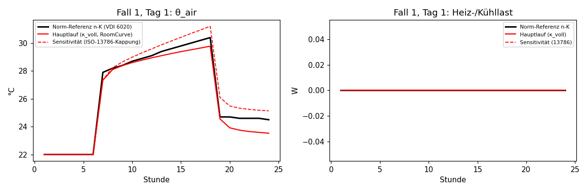
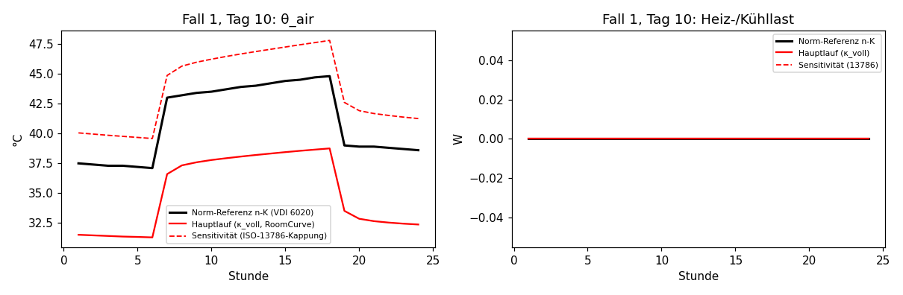
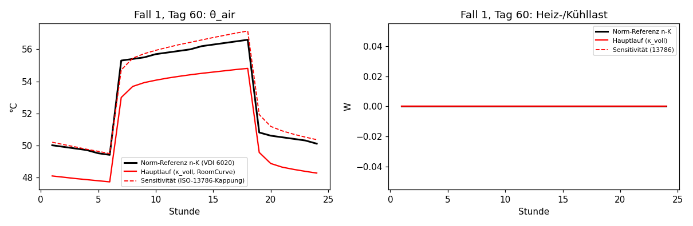

### Fall 2

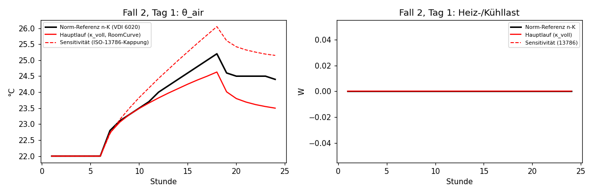
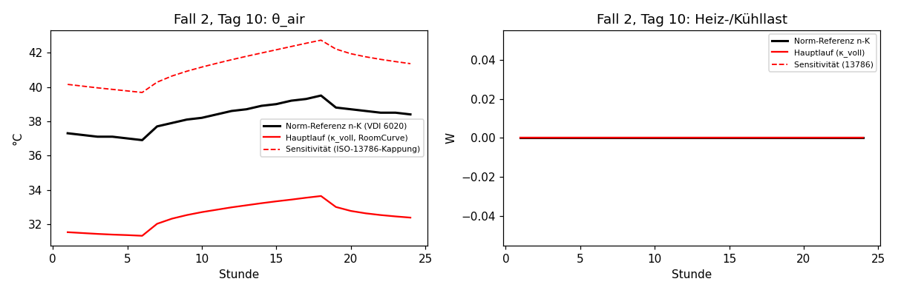
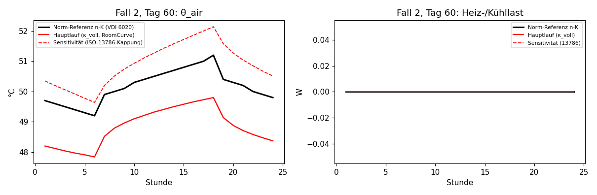

### Fall 3

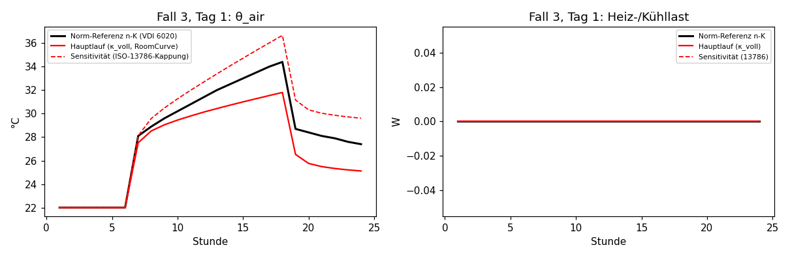
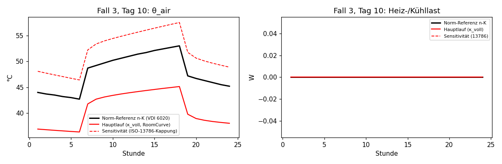
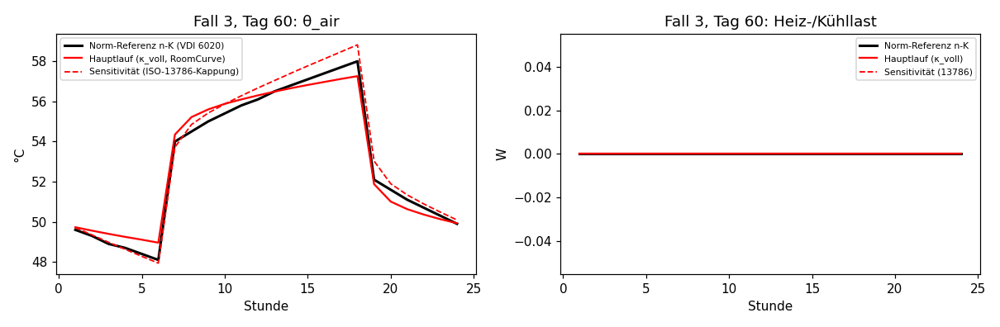

### Fall 4

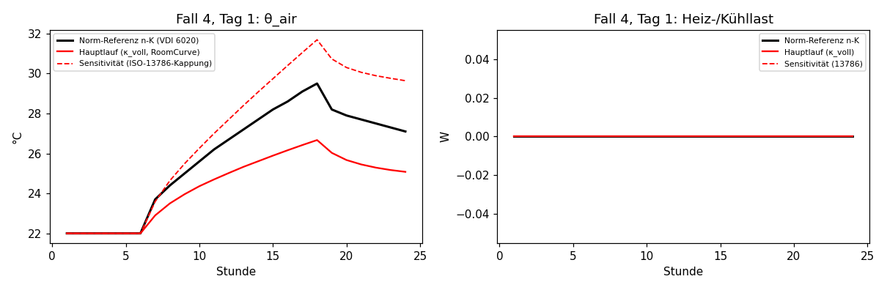
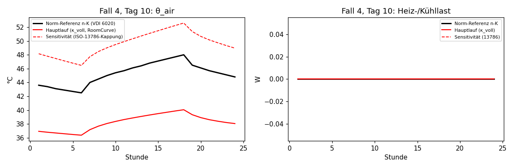
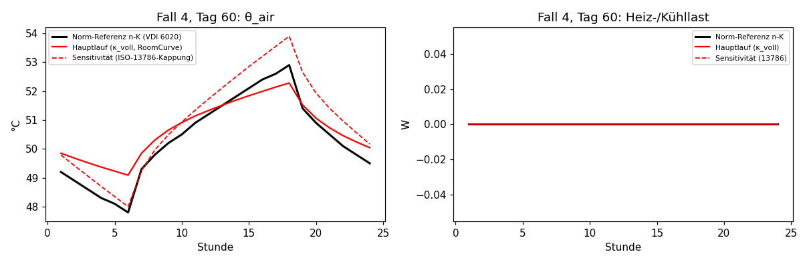

### Fall 5

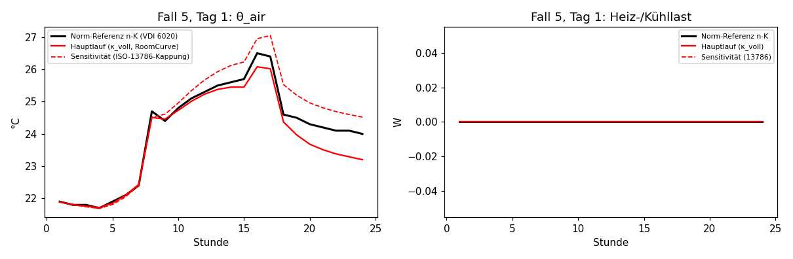
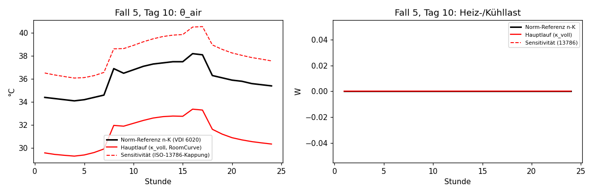
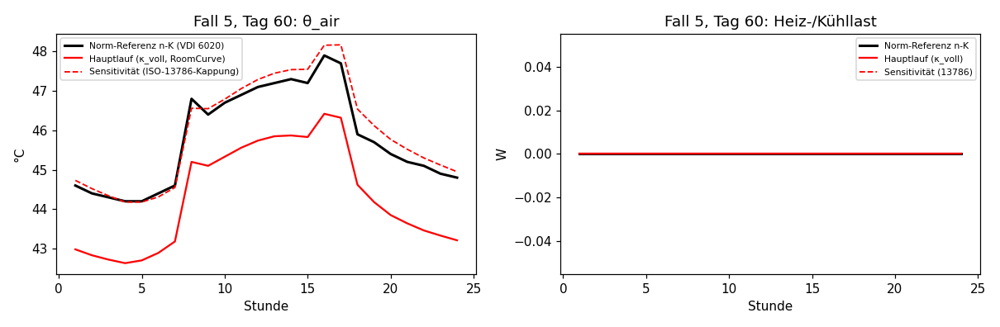

### Fall 6

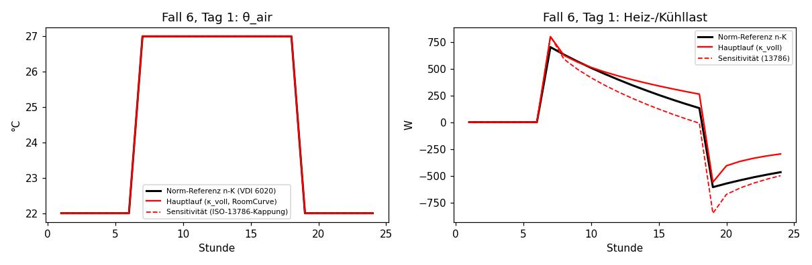

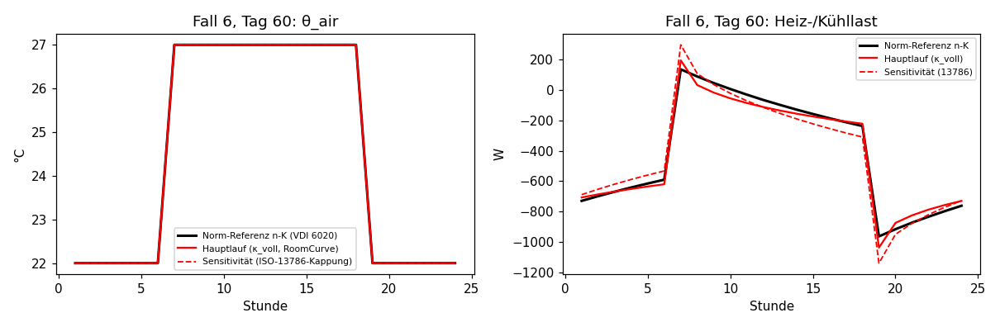

### Fall 7

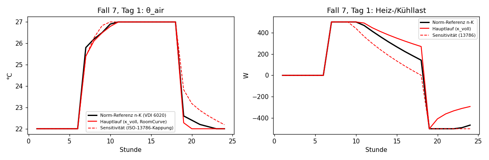
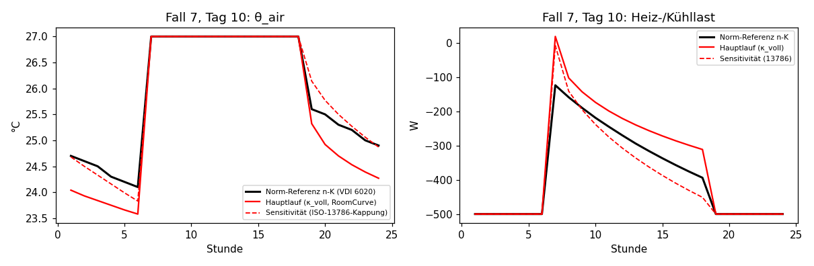
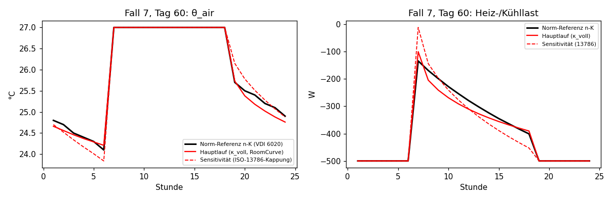
